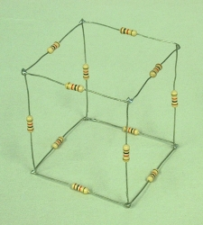

---
geometry:
- margin=1.25in
mainfont: Palatino
header-includes: 
- \usepackage[document]{ragged2e}
---

# Assignment 5
## Physics assignment 2

### Instructions
- PHY410: Do problems 1–3.
- PHY 505: Do all four problems.

Accept the assignment from github classroom: https://classroom.github.com/a/Fs43SiCG. This will create a new repository for you on github, titled something like `compphys-assignment5-username`.
You should submit your code through github classroom, and your writeup through UBLearns. If you prefer, you can do your writeup "in-line" in your notebooks (using Markdown cells), convert the notebook to HTML/PDF/etc., and upload the converted notebooks.

\newpage

## Problem 1
*25 points*

This problem involves scattering trajectories and cross sections using the calculus tools covered in class. Please do your work in `Problem1/Problem1.ipynb`. 

### Problem 1a
*15 points*

Using the tools covered in class (specifically those used in CompPhys/Calculus/scattering.ipynb), study classical scattering from a hard sphere and from the Lennard–Jones potential. 

1. Plot some typical trajectories.
2. Compute and plot the differential scattering cross section versus $\theta_s$ for the hard-sphere and Lennard–Jones scenarios. Recall that the differential cross section is given by:

$$
\frac{d\sigma}{d\Omega} = \frac{b}{\sin\theta_s}\left\vert \frac{d\theta_s}{db}\right|^{-1}
$$

To compute $\frac{d\theta_s}{db}$, you will need to determine the scattering angle for different impact parameters, and then take the derivative numerically (using, for example, the five-point stencil method). 

### Problem 1b
*10 points*

For the Lennard–Jones potential, compute the trajectories for some values of the energy that demonstrate the phenomenon of orbiting. What is the maximum number of orbits that you can generate by carefully tuning the energy and impact parameter? 

\newpage

## Problem 2
*25 points*

Do your work in the notebook `Problem2/Problem2.ipynb`. 

Determine the equilibrium configurations of $\rm{Na}_4\rm{Cl}_4$ clusters for tetramers (n=4) in this paper: K. Michaelian, "Evolving few-ion clusters of Na and Cl",Am. J. Phys. 66, 231 (1998)." The paper can be found in this repository, and the configurations are copied below.

- Plot the equilibrium configurations using the macros from class (x,y,z in scatter plots). 
- Label them with their energies. 

Initialize them to an “ideal” case for the geometry, and allow the optimization to determine the final configurations.

")

\newpage

## Problem 3
*25 points*

Do your work for this problem in `Problem3/Problem3.ipynb`.

Write a program to solve for the currents in a resistor cube. There are 12 resistors, one along each edge. A voltage source is connected across a body diagonal of the cube. 

### Problem 3a
*10 points*

Using your program (i.e., using the linear algebra techniques covered in class, not just solving the problem directly!), find the equivalent resistance for the symmetric case when all the resistors have the same resistance, $R=1\,\Omega$. You might remember this problem from your E&M class.

### Problem 3b
*15 points*

Vary the resistance of one resistor at a time. How many unique cases are there? Plot the equivalent resistance as a function of the resistance of the one resistor being varied for all of the unique cases.

\newpage

## Problem 4
*25 points*

PHY505 students only. Do your work in the notebook `Problem4/Problem4.ipynb`. 

Repeat Assignment 4, Problem 1b (the fit to CO2 data from Mauna Loa with a quadratic
function), but this time use the BFGS algorithm to perform a minimization of the chi-squared
function numerically. Compare to the methods from the previous homework assignment. 

Note: remember that you are optimizing over the *fit parameters*, not the CO2 x and y values!

