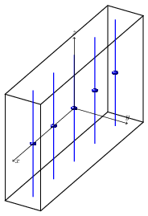
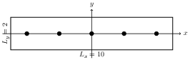

---
geometry:
- margin=1.25in
mainfont: Palatino
header-includes: 
- \usepackage[document]{ragged2e}
---

# Assignment 6
## Physics assignment 3

### Instructions
- PHY410: Do problems 1–3.
- PHY 505: Do all four problems.

Accept the assignment from github classroom: https://classroom.github.com/a/TBD. This will create a new repository for you on github, titled something like `compphys-assignment6-username`.
You should submit your code through github classroom, and your writeup through UBLearns. If you prefer, you can do your writeup "in-line" in your notebooks (using Markdown cells), convert the notebook to HTML/PDF/etc., and upload the converted notebooks.


\newpage

## Problem 1: nonlinear pendulum
*25 points*

This problem starts from the `CompPhys/ODEs/pendulum_nonlinear.ipynb` notebook covered in class. The relevant parts of this notebook have been copied to `Problem1/Problem1.ipynb`, where you should do your work for this problem. 

### Problem 1a
*10 points*

Generate a bifurcation diagram (as described in class; also see [wikipedia](https://en.wikipedia.org/wiki/Bifurcation_diagram)) as a function of the input strength, $F_D$, of a damped, driven harmonic oscillator. Vary $F_D$ between 0.7 and 1.1. 

You can use the following values for the other parameters:

```
ode_method = "RK45"
t_max = 2000. # Time interval to run over
theta_init = 0.0 # Initial value of theta
omega_init = 0.0 # Initial value of omega = d(theta)/dt
gamma = 0.5 # Damping parameter
omega_0 = 1.0 # Natural frequency
omega_D = 2./3 # Driving force frequency
```

Your diagram should demonstrate the transitions between 1-cycle, 2-cycle, 4-cycle, and chaotic behavior. Remember to throw away the first ~100 cycles from the Poincaré map, which contain the damped transient behavior. 


### Problem 1b
*15 points*

Plot the time series ($\theta(t)$) for specific values of $F_D$ corresponding to a 1-cycle, a 2-cycle, a 4-cycle, chaos. Then, take the FFT of the time series and compare the four spectra. 


\newpage


## Problem 2: perturbed hydrogen atom
*25 points*

Do your work in the notebook `Problem2/Problem2.ipynb`. Starting from the `CompPhys/BVPs/schoedinger.ipynb` notebook, investigate a quartic and a cubic perturbation to the quantum harmonic oscillator of the types:

$$
\begin{aligned}
V_1(x) &= \frac{1}{2} m \omega^2 \left(\hat{x}^2 + \frac{1}{20} \hat{x}^3 \right) \\
V_2(x) &= \frac{1}{2} m \omega^2 \left(\hat{x}^2 + \frac{1}{20}\hat{x}^4\right)
\end{aligned}
$$

Compute the energy levels and eigenfunctions up to $E=5$. Discuss how each type of perturbation modifies the energy levels and eigenfunctions. Be sure to increase the left and right boundaries if needed.

\newpage


## Problem 3: dipole in a box
*25 points*

### Problem 3a
*15 points*

Do your work in the notebook `Problem3/Problem3.ipynb`. Starting from the `CompPhys/PDEs/poisson.ipynb` notebook, use the Jacobi method with vectorization to compute the electrostatic potential due to an electric dipole with charge $q=10$ (i.e., there are two particles each of charge $q$), located at the center of a two-dimensional, grounded, square metal box of length $L=1$. The dipole should be parallel to the x-axis and have length $d=0.5$. 

### Problem 3b
*10 points*

Compare with the expected exact solution (i.e., the sum of the Coulomb potentials of the same two point charges) in free space. Only plot the solution within the same box of length $L=1$, even though the solution technically extends to infinity. Your exact solution should not contain any python loops, i.e., it should be vectorizable. 


\newpage


### Problem 4: wire chamber 
*25 points*

PHY505 students only; do your work in the notebook `Problem4/Problem4.ipynb`. 

In a wire chamber, several parallel wires are passed through a metal box. The wires are kept at a fixed potential ($V_0=5$), and the box edges are kept at ground. 

 




### Problem 4a
*15 points*

Consider a wire chamber that is infinitely long $z$ direction (so this reduces to a 2-dimensional problem), with $L_x=10$ and $L_y=2$. Compute the electrostatic potential for 5 wires running along the $z$ axis, equally spaced through a box, where all of the wires pass through the $x$ axis and the middle wire passes through the origin (i.e., the box spans $-5<x<5$, and the wires pass through the x-axis at $x=-4, -2, 0, 2, 4$). 

You will have to adjust the code to handle fixed potential instead of fixed charge. You'll also have to adjust the dimensions of the box.


### Problem 4b
*10 points*

Compute the trajectory of a charged particle with charge $q=10$, mass $m=1$, initial position $(4,0)$, and initial velocity $(1,1)$. The potential from (4a) is your starting point; numerically evaluate the gradient to compute the electric field. Use the result as the acceleration for your derivative method. 

Warning: you might run into trouble with adaptive schemes, because you are limited by the precision of your field calculation in (4a). Watch out for this and try to address any such issues!


